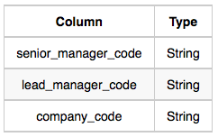
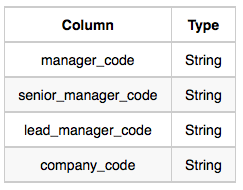

# New Companies
Amber's conglomerate corporation just acquired some new companies. Each of the companies follows this hierarchy:


Given the table schemas below, write a query to print the *company_code*, *founder* name, total number of *lead* managers, total number of *senior* managers, total number of *managers*, and total number of *employees*. Order your output by ascending *company_code*.
### Note:
 * The tables may contain duplicate records.
 * The *company_code* is string, so the sorting should not be **numeric**. For example, if the *company_codes* are *C_1*, *C_2*, and *C_10*, then the ascending *company_codes* will be *C_1*, *C_10*, and *C_2*.
---
### Input Format
The following tables contain company data:
 * *Company*: The *company_code* is the code of the company and *founder* is the founder of the company.

   
 * *Lead_Manager*: The *lead_manager_code* is the code of the lead manager, and the *company_code* is the code of the working company.   
 
   
 * *Senior_Manager*: The *senior_manager_code* is the code of the senior manager, the *lead_manager_code* is the code of its lead manager, and the *company_code* is the code of the working company.
   
   
 * *Manager*: The *manager_code* is the code of the manager, the *senior_manager_code* is the code of its senior manager, the *lead_manager_code* is the code of its lead manager, and the *company_code* is the code of the working company.
 
   
 * *Employee*: The *employee_code* is the code of the employee, the *manager_code* is the code of its manager, the *senior_manager_code* is the code of its senior manager, the *lead_manager_code* is the code of its lead manager, and the *company_code* is the code of the working company.
   
---

 
 
 
 
 senior_manager

### Sample Output
```
1 Leaf
2 Inner
3 Leaf
5 Root
6 Leaf
8 Inner
9 Leaf
```
### Explanation
The *Binary Tree* below illustrates the sample:

