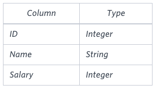
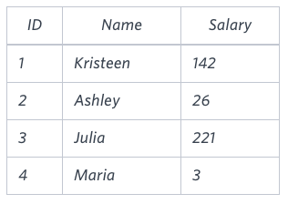

# The Blunder
Samantha was tasked with calculating the average monthly salaries for all employees in the **EMPLOYEES** table, but did not realize her keyboard's 0 key was broken until after completing the calculation. She wants your help finding the difference between her miscalculation (using salaries with any zeroes removed), and the actual average salary.

Write a query calculating the amount of error (i.e.: *actual - miscalculated* average monthly salaries), and round it up to the next integer.
### Input Format
The **EMPLOYEES** table is described as follows:



**Note:** *Salary* is measured in dollars per month and its value is < 10<sup>5</sup>.
### Sample Input


### Sample Output
```
2061
```
### Explanation
The table below shows the salaries *without zeroes* as they were entered by Samantha:



Samantha computes an average salary of `98.0`. The *actual average salary* is `2159.00`.
The resulting error between the two calculations is `2159.0 - 98.0 = 2061.00` which, when rounded to the next integer, is `2061`.